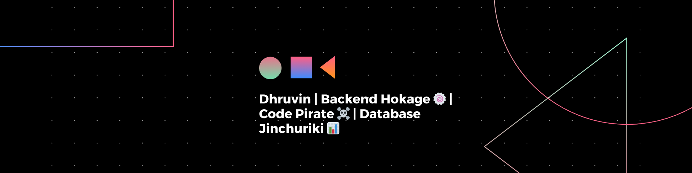

# Hey there! I am Dhruvin Lad!  
- 👨‍💻  A **Web Developer**, and a **Competitive Coder**.
- 🔭 I’m currently working on a Payment Gateway Integration.
- 🌱 I’m currently learning **React Native and DevOps**.
- 👯 I’m looking to collaborate on **web projects**.
- 💬 Ask me anything about **tech and anime**.
- 😄 Pronouns: **He/His**.
- 📃 [My Resume](resume.pdf)
- ⚡ Fun fact: Debugging is like being the detective in a crime movie where you are also the murderer.
- 📫 How to reach me: <strong>(Click the badge to view my profiles!)</strong>  

## 🌐Socials
    

# 💻Tech Stack
                       

# 📊GitHub Stats :

   
  

  
 

## 🏆GitHub Trophies

## ✍️Random Dev Quote

 
  
  

---

### Show some ❤️ by starring some of the repositories!

